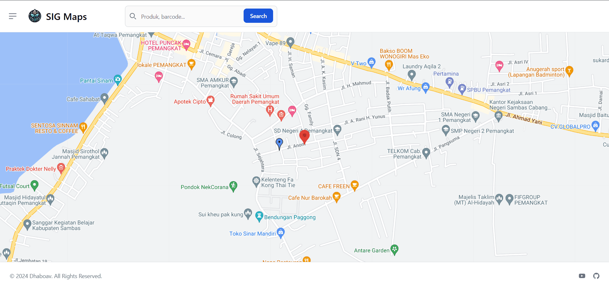

<!-- PROJECT LOGO -->
<br />
<div align="center">
<h3 align="center">GeoAI-Maps</h3>

  <p align="center">
    This repository is about using google maps service with feature adding custom marker and product into it.
  </p>
</div>


<p>Home Sample:</p>
<div style="text-align:center;">
    
</div>

<!-- GETTING STARTED -->
### Guide to Install
1. Clone the repo
  ```git
    git clone https://github.com/Dhaboav/product-maps.git
  ```

2. Navigate into project directory
  ```cmd
    cd product-maps;
  ```

3. Install Dependencies
  ```cmd
    composer install
  ``` 

4. Set up .env
  ```cmd
    copy .env.example .env;
  ``` 

5. Configure the database and google API key
  ```cmd
    DB_CONNECTION=mysql
    DB_HOST=127.0.0.1
    DB_PORT=3306
    DB_DATABASE=your_database_name
    DB_USERNAME=your_database_user
    DB_PASSWORD=your_database_password
    GOOGLE_MAPS_API_KEY=your_API_key
  ```

6. Generate an Application Key
  ```cmd
    php artisan key:generate
  ``` 

7. Run Database Migrations
  ```cmd
    php artisan migrate
  ``` 

8. Serve the Application
  ```cmd
    php artisan serve + npm run dev (development only)
  ``` 